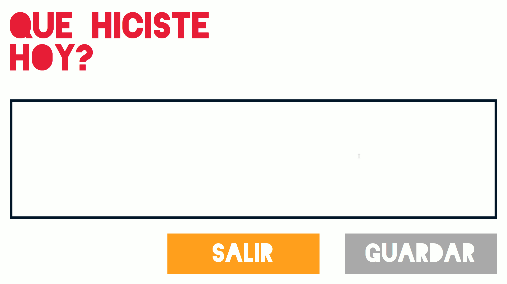

# Rompebolas

¯\\_(ツ)_/¯ A simple tool to remind developers to log their work at the end of the day.

When run, it opens in full screen and prompt for a log message.

The message is saved in a filed called `~/rompe.txt` with the date it was generated on.

It supports multilanguage using `goi18n`.

and be carefull when exit...

## Pre-requisites
 - Golang

## Recommended install instructions

1. Get dependencies
        
        make setup
        
2. Build the project

        make build
        
3. Copy the executable somewhere you like. eg:

        cp rompebolas ~/bin/
        
4. Create a crontab entry to run it whenever you want. eg:

        crontab -e
        
        # insert the following line in the crontab, with the correct path to the executable
        
        [[minutes]] [[hour]] * * 1-5 DISPLAY=:0.0 [[EXECUTABLE_PATH]]rompebolas >/dev/null 2>&1
        
        # eg:
        
        50 17 * * 1-5 DISPLAY=:0.0 /home/mlambir/bin/rompebolas >/dev/null 2>&1

This will run the program once a day every weekday at 5:50 pm

5. Or just run it:

        make run